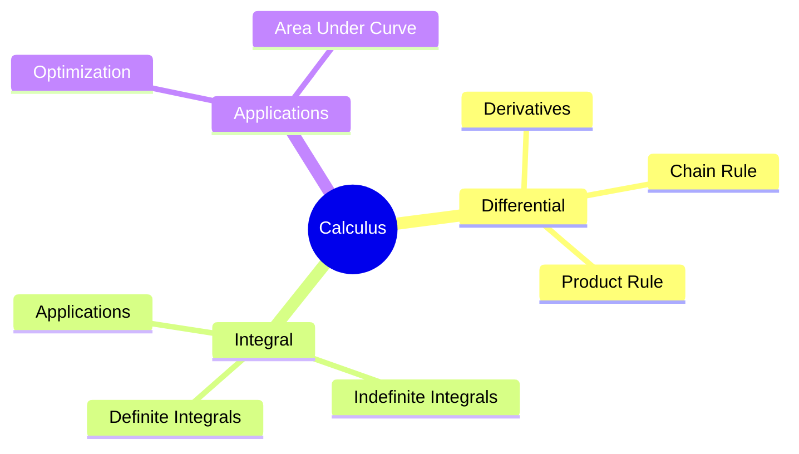
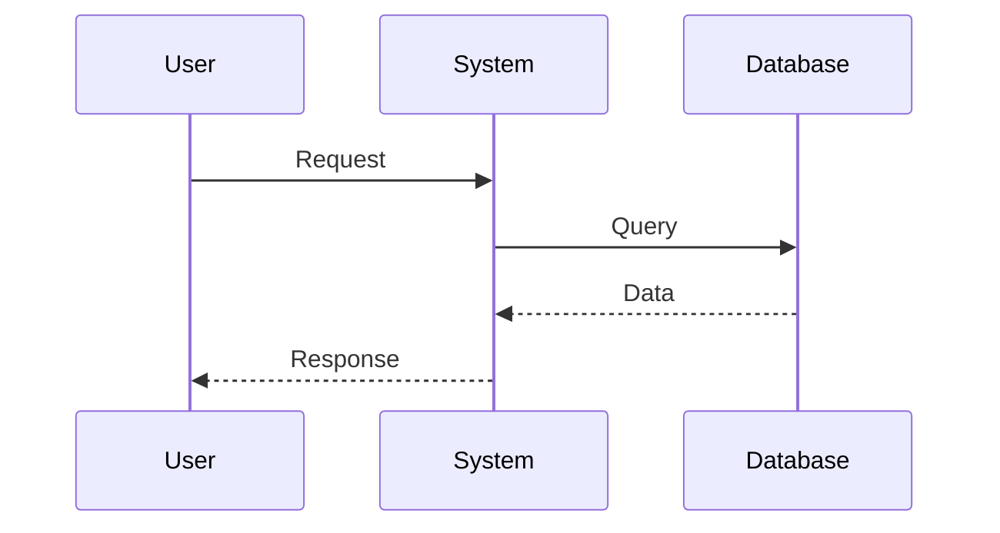
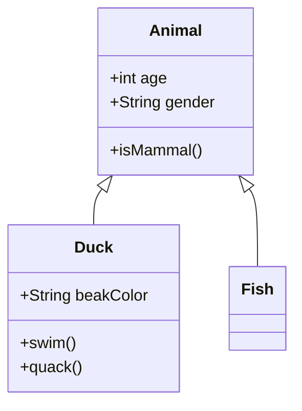
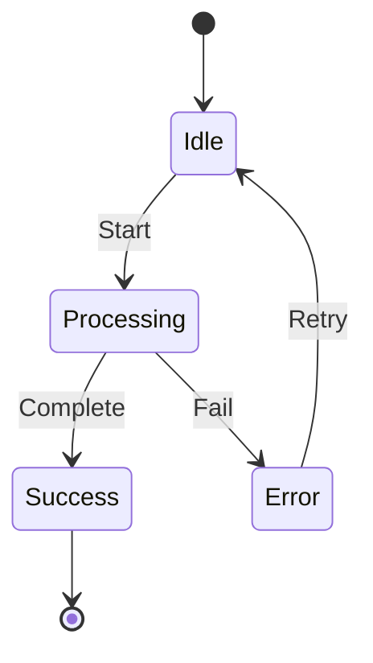
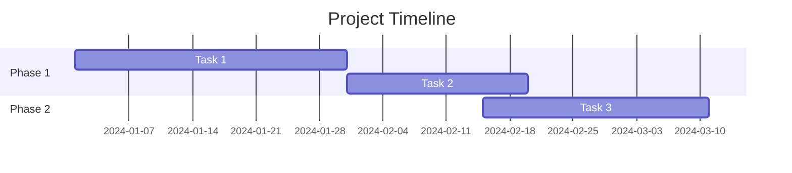
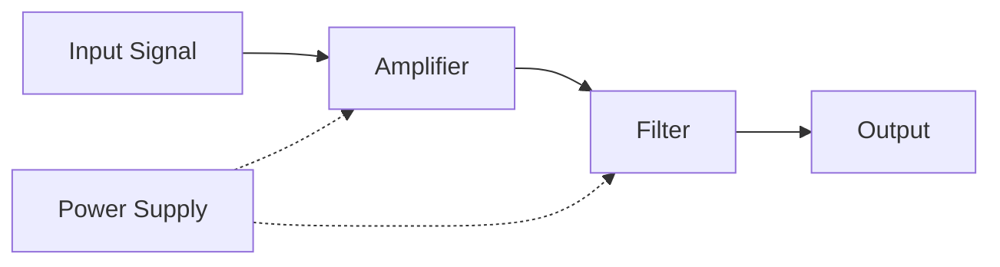
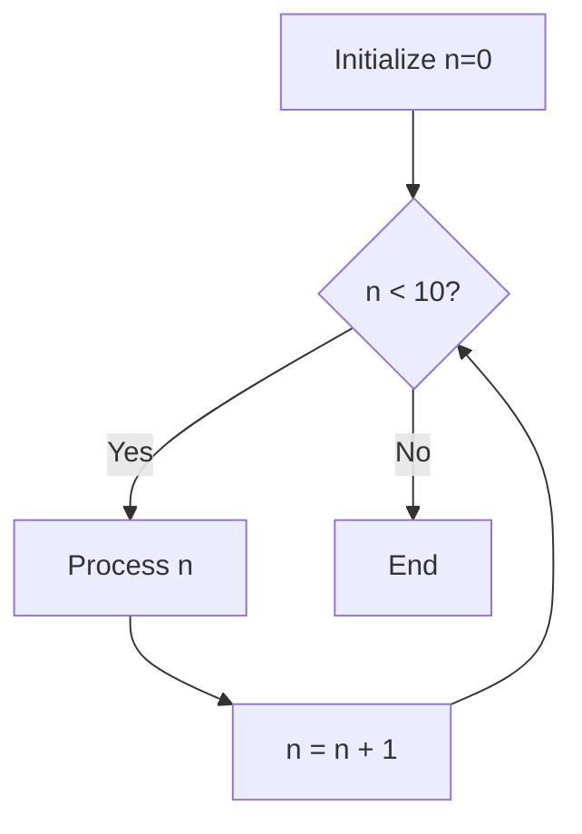

# Rich Media and Visualization Guide

Complete guide to using LaTeX equations, graphs, diagrams, and code snippets in flashcards.

## Table of Contents

1. [LaTeX/Math Equations](#latex-math-equations)
2. [Python Graph Generation](#python-graph-generation)
3. [Mermaid.js Diagrams](#mermaidjs-diagrams)
4. [Code Snippets](#code-snippets)
5. [Combining Multiple Media Types](#combining-multiple-media-types)
6. [Best Practices](#best-practices)
7. [Security Considerations](#security-considerations)
8. [Troubleshooting](#troubleshooting)

---

## LaTeX/Math Equations

### Overview

LaTeX equations are rendered using MathJax 3, providing professional-quality mathematical typography in your flashcards.

### Inline Math

Use single dollar signs `$...$` for inline equations:

```
Question: What is the derivative of $f(x) = x^2$?
Answer: $f'(x) = 2x$
```

### Display Math

Use double dollar signs `$$...$$` for centered display equations:

```
Question: State the Pythagorean theorem.
Answer: $$a^2 + b^2 = c^2$$
```

### Common LaTeX Syntax

**Fractions:**
```latex
$\frac{numerator}{denominator}$
$$\frac{-b \pm \sqrt{b^2 - 4ac}}{2a}$$
```

**Integrals:**
```latex
$$\int_0^\infty e^{-x^2} dx = \frac{\sqrt{\pi}}{2}$$
```

**Summations:**
```latex
$$\sum_{i=1}^{n} i = \frac{n(n+1)}{2}$$
```

**Greek Letters:**
```latex
$\alpha, \beta, \gamma, \delta, \theta, \lambda, \mu, \pi, \sigma, \omega$
```

**Superscripts and Subscripts:**
```latex
$x^2, x_i, x_i^2, e^{i\pi}$
```

**Matrices:**
```latex
$$\begin{bmatrix}
a & b \\
c & d
\end{bmatrix}$$
```

### Engineering-Specific Examples

**Electrical Engineering:**
```latex
Power: $P = VI = I^2R = \frac{V^2}{R}$

Impedance: $Z = R + jX = |Z|e^{j\theta}$

Fourier Transform: $$F(\omega) = \int_{-\infty}^{\infty} f(t)e^{-j\omega t} dt$$
```

**Calculus:**
```latex
Chain Rule: $\frac{dy}{dx} = \frac{dy}{du} \cdot \frac{du}{dx}$

Taylor Series: $$f(x) = \sum_{n=0}^{\infty} \frac{f^{(n)}(a)}{n!}(x-a)^n$$
```

**Linear Algebra:**
```latex
Eigenvalue Equation: $A\vec{v} = \lambda\vec{v}$

Determinant: $$\det(A) = \begin{vmatrix} a & b \\ c & d \end{vmatrix} = ad - bc$$
```

### Enabling LaTeX in Flashcards

1. Go to Django Admin → Flashcards
2. Create or edit a flashcard
3. Check the "Uses LaTeX" checkbox
4. Add LaTeX syntax to your question or answer
5. Save

---

## Python Graph Generation

### Overview

Generate dynamic graphs using matplotlib and numpy. Graphs are executed in a secure sandbox and cached as images.

### Basic Function Plot

```python
x = np.linspace(-10, 10, 100)
y = np.sin(x)
plt.plot(x, y)
plt.grid(True)
plt.title('Sine Wave')
plt.xlabel('x')
plt.ylabel('sin(x)')
```

### Multiple Functions

```python
x = np.linspace(-5, 5, 100)
y1 = x**2
y2 = x**3
plt.plot(x, y1, label='x²')
plt.plot(x, y2, label='x³')
plt.legend()
plt.grid(True)
plt.axhline(0, color='black', linewidth=0.5)
plt.axvline(0, color='black', linewidth=0.5)
```

### Parametric Plots

```python
t = np.linspace(0, 2*np.pi, 100)
x = np.cos(t)
y = np.sin(t)
plt.plot(x, y)
plt.axis('equal')
plt.grid(True)
plt.title('Circle')
```

### Vector Fields

```python
x = np.linspace(-2, 2, 10)
y = np.linspace(-2, 2, 10)
X, Y = np.meshgrid(x, y)
U = -Y
V = X
plt.quiver(X, Y, U, V)
plt.grid(True)
plt.title('Vector Field')
```

### Parameterized Graphs

For parameterized flashcards, use variable placeholders:

```python
# For a card with parameters a, b, c
x = np.linspace(-5, 5, 100)
y = {a}*x**2 + {b}*x + {c}
plt.plot(x, y)
plt.axhline(0, color='black', linewidth=0.5)
plt.axvline(0, color='black', linewidth=0.5)
plt.grid(True)
plt.title(f'y = {a}x² + {b}x + {c}')
```

### Graph Configuration

Add JSON configuration for graph properties:

```json
{
  "title": "Quadratic Function",
  "xlabel": "x-axis",
  "ylabel": "y-axis",
  "xlim": [-10, 10],
  "ylim": [-5, 5],
  "grid": true
}
```

### Available Graph Types

1. **Function Plot**: Plot y = f(x)
2. **Parametric Plot**: Plot x(t), y(t)
3. **3D Surface Plot**: Plot z = f(x,y)
4. **Vector Field**: Plot direction fields

### Security Features

- Sandboxed execution (no file system access)
- Whitelisted imports only (numpy, matplotlib, math)
- 3-second execution timeout
- No network access
- No arbitrary code execution

---

## Mermaid.js Diagrams

### Overview

Create beautiful diagrams using simple text syntax. Diagrams render in the browser with Mermaid.js.

### Flowcharts

```mermaid
flowchart TD
    A[Start] --> B{Is x > 0?}
    B -->|Yes| C[Return sqrt(x)]
    B -->|No| D[Return error]
    C --> E[End]
    D --> E
```

**Syntax:**
```
flowchart TD
    A[Start] --> B{Decision}
    B -->|Yes| C[Process]
    B -->|No| D[End]
```

**Node Types:**
- `[Rectangle]` - Process
- `{Diamond}` - Decision
- `((Circle))` - Terminal
- `>Asymmetric]` - Input/Output

### Mind Maps



### Sequence Diagrams



### Class Diagrams



### State Diagrams



### Gantt Charts



### Engineering Applications

**Circuit Block Diagram:**


**Algorithm Flowchart:**


---

## Code Snippets

### Overview

Display syntax-highlighted code in your flashcards using Prism.js.

### Supported Languages

- Python
- C
- C++
- MATLAB
- VHDL
- JavaScript

### Python Example

```python
def factorial(n):
    """Calculate factorial recursively"""
    if n <= 1:
        return 1
    return n * factorial(n - 1)

# Usage
result = factorial(5)
print(f"5! = {result}")
```

### C Example

```c
#include <stdio.h>

int factorial(int n) {
    if (n <= 1) {
        return 1;
    }
    return n * factorial(n - 1);
}

int main() {
    printf("5! = %d\n", factorial(5));
    return 0;
}
```

### MATLAB Example

```matlab
function result = factorial(n)
    % Calculate factorial
    if n <= 1
        result = 1;
    else
        result = n * factorial(n - 1);
    end
end
```

### Adding Code to Flashcards

1. Go to Django Admin → Flashcards
2. Create or edit a flashcard
3. Expand the "Code Snippets" section
4. Select the programming language
5. Paste your code in the "Code Snippet" field
6. Save

---

## Combining Multiple Media Types

### Example: Complete Engineering Problem

**Question:**
```
Analyze the following circuit and calculate the output voltage.

[Insert circuit diagram with Mermaid]

Given:
- Input voltage: $V_{in} = 10V$
- Resistances: $R_1 = 1k\Omega$, $R_2 = 2k\Omega$

Python code for simulation:
[Insert code snippet]

Graph of voltage vs. time:
[Insert matplotlib graph]
```

### Workflow for Complex Cards

1. **LaTeX** for equations and formulas
2. **Diagram** for visual representation
3. **Code** for implementation
4. **Graph** for results visualization

### Example Card Structure

```
Field: Question
Text: "Design a low-pass filter with cutoff frequency $f_c = 1kHz$"

Field: Diagram Type
Value: flowchart

Field: Diagram Code
Value: [Circuit block diagram]

Field: Answer
Text: "Transfer function: $H(s) = \frac{1}{1 + sRC}$"

Field: Code Language
Value: python

Field: Code Snippet
Value: [Python implementation]

Field: Graph Type
Value: function

Field: Graph Code
Value: [Frequency response plot]
```

---

## Best Practices

### When to Use Each Media Type

**LaTeX:**
- Mathematical equations
- Physics formulas
- Engineering calculations
- Theoretical concepts

**Graphs:**
- Function behavior
- Data visualization
- Response curves
- Relationships between variables

**Diagrams:**
- Process flows
- System architectures
- Algorithm steps
- Conceptual relationships

**Code:**
- Algorithm implementation
- Syntax examples
- Problem solutions
- Programming concepts

### Performance Considerations

1. **LaTeX**: Minimal impact, renders quickly
2. **Graphs**: Generated once and cached
3. **Diagrams**: Lightweight, render in browser
4. **Code**: No impact, syntax highlighting is fast

### Accessibility

- Always include text descriptions
- Provide alt text for generated images
- Use semantic HTML structure
- Ensure color contrast for readability

---

## Security Considerations

### Graph Generation Security

1. **Sandboxed Execution**: Code runs in restricted environment
2. **Whitelisted Imports**: Only numpy, matplotlib, math allowed
3. **No File Access**: Cannot read/write files
4. **No Network Access**: Cannot make HTTP requests
5. **Timeout Protection**: 3-second maximum execution time

### Forbidden Operations

These will raise errors:
- `import os`
- `import subprocess`
- `open('file.txt')`
- `exec('code')`
- `eval('expression')`
- `__import__('module')`

### Safe Operations

These are allowed:
- `np.linspace()`, `np.sin()`, `np.cos()`, etc.
- `plt.plot()`, `plt.scatter()`, `plt.bar()`, etc.
- Basic math: `+`, `-`, `*`, `/`, `**`, `sqrt()`, `abs()`

---

## Troubleshooting

### LaTeX Not Rendering

**Problem**: Equations appear as raw text
**Solution**:
1. Ensure "Uses LaTeX" checkbox is checked
2. Verify MathJax is loaded (check browser console)
3. Check LaTeX syntax is correct
4. Try refreshing the page

### Graph Not Generating

**Problem**: Graph image doesn't appear
**Solution**:
1. Check graph code for syntax errors
2. Verify allowed functions are used
3. Check execution timeout (keep code simple)
4. View Django logs for error messages

### Diagram Not Rendering

**Problem**: Diagram code appears as text
**Solution**:
1. Verify Mermaid.js is loaded
2. Check diagram syntax
3. Ensure diagram type is set correctly
4. Try a different browser

### Code Not Highlighted

**Problem**: Code appears as plain text
**Solution**:
1. Verify language is selected
2. Check Prism.js is loaded
3. Ensure code is in "Code Snippet" field
4. Refresh the page

### Common LaTeX Errors

**Error**: Undefined control sequence
**Fix**: Check backslashes are escaped: `\\` instead of `\`

**Error**: Missing $ inserted
**Fix**: Ensure math mode delimiters match: `$...$` or `$$...$$`

**Error**: Extra } or missing {
**Fix**: Balance all braces in commands like `\frac{num}{den}`

### Common Mermaid Errors

**Error**: Diagram doesn't render
**Fix**: Check indentation (Mermaid is whitespace-sensitive)

**Error**: Syntax error in text
**Fix**: Escape special characters in labels

---

## Examples Gallery

### Mathematics

**Calculus Flashcard:**
- Question: "Find $\frac{d}{dx}[\sin(x^2)]$"
- Answer: "$2x\cos(x^2)$ using chain rule"
- Graph: Plot of $\sin(x^2)$ and its derivative

**Linear Algebra:**
- Question: "Find eigenvalues of $A = \begin{bmatrix}2 & 1\\1 & 2\end{bmatrix}$"
- Answer: "$\lambda = 3, 1$"
- Diagram: Mind map of eigenvalue concepts

### Engineering

**Circuit Analysis:**
- Question: "Calculate output voltage"
- Diagram: Circuit schematic
- LaTeX: Voltage divider equation
- Answer: Calculation with LaTeX

**Signal Processing:**
- Question: "Design Butterworth filter"
- Code: Python implementation
- Graph: Frequency response
- LaTeX: Transfer function

### Programming

**Algorithm:**
- Question: "Implement bubble sort"
- Code: Complete implementation
- Diagram: Flowchart of algorithm
- Answer: Time complexity $O(n^2)$

---

## Additional Resources

- **MathJax Documentation**: https://docs.mathjax.org/
- **Matplotlib Gallery**: https://matplotlib.org/stable/gallery/
- **Mermaid.js Live Editor**: https://mermaid.live/
- **Prism.js**: https://prismjs.com/
- **LaTeX Mathematics**: https://en.wikibooks.org/wiki/LaTeX/Mathematics

---

**Happy Learning with Rich Media! 🎓✨**
